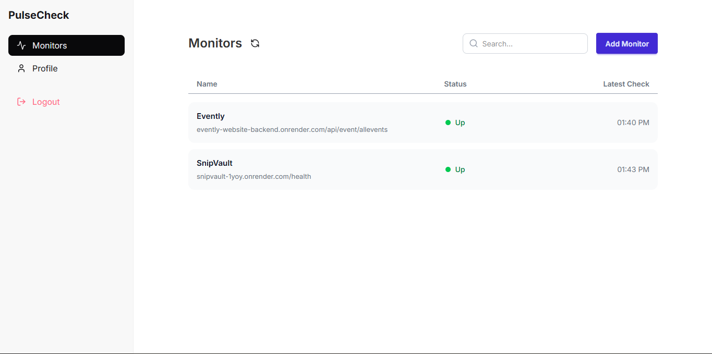

# PulseCheck – Website & API Uptime Monitoring Tool

[](LICENSE)
[](https://nodejs.org/)
[](https://www.mongodb.com/)

PulseCheck is a real-time **website and API uptime monitoring platform** that helps users track availability, response times, and service reliability. Users can configure monitors, receive instant email alerts on downtime, and analyze historical performance data via a secure dashboard.

> **Note:** The UI is optimized for desktop and laptop screens. Mobile responsiveness is limited by design.

---

## 🚀 Live Demo

## https://pulse-check-api-monitoring.vercel.app

## ✨ Features

- Create uptime monitors for **HTTP/HTTPS websites and APIs**
- Configurable monitoring intervals (10, 15, 30, 60 minutes)
- Automated health checks with **response time tracking**
- Real-time status updates (**Up / Down**)
- Detailed historical analytics (best, worst, average response time)
- Instant **email notifications** on status changes
- Secure user authentication with protected routes
- Safe deletion of monitors and user accounts with **cascading cleanup**
- Clean, modern dashboard UI (desktop-focused)

---

## 🛠️ Tech Stack

### Frontend

- React
- Tailwind CSS
- DaisyUI
- React Router
- Lucide Icons

### Backend

- Node.js
- Express.js
- MongoDB
- Mongoose
- Axios

### Other Services

- **Email Notifications:** Resend API
- **Authentication:** JWT-based auth with HTTP-only cookies

---

## 📸 Screenshots

### Home Page


### Dashboard



### Monitor Details


---

## ⚙️ Installation & Setup

### Prerequisites

- Node.js v18+
- MongoDB (local or cloud)
- Resend API key

---

### 1. Clone the Repository

```bash
git clone https://github.com/TejasBirla/pulseCheck.git
cd pulsecheck
```

---

### 2. Backend Setup

```bash
cd backend
npm install
```

Create a `.env` file in the `backend` directory:

```env
PORT=5000
MONGO_URI=your_mongodb_connection_string
JWT_SECRET=your_jwt_secret
RESEND_API_KEY=your_resend_api_key
CLIENT_URL=http://localhost:5173
```

Start the backend server:

```bash
npm run dev
```

---

### 3. Frontend Setup

```bash
cd frontend
npm install
npm run dev
```

The application should now be running locally.

---

## 📁 Project Structure

```text
pulseCheck/
│
├── backend/
│   └── src/
│       ├── controllers/
│       ├── models/
│       ├── routes/
│       ├── middlewares/
│       ├── utils/
│       ├── services/
│       └── server.js
│
├── frontend/
│   └── src/
│       ├── components/
│       ├── contexts/
│       ├── pages/
│       ├── assets/
│       ├── services/
│       └── main.jsx
│
├── screenshots/
│   ├── home-ss.png
│   ├── monitors-ss.png
│   └── monitorDetail-ss.png
│
└── README.md
```

---

## 🔒 Security Notes

- JWT tokens are stored in **HTTP-only cookies**
- Protected API routes prevent unauthorized access
- User data is isolated per account

---

## 📌 Future Improvements

- Full mobile responsiveness
- Pause / resume monitors
- Webhook & Slack alerts
- Status page for public sharing
- Advanced charts and uptime percentages

---

## 📄 License

This project is licensed under the **MIT License**.

---

## 🙌 Acknowledgements

Inspired by tools like UptimeRobot and pulsetic, built as a full‑stack learning and portfolio project.
